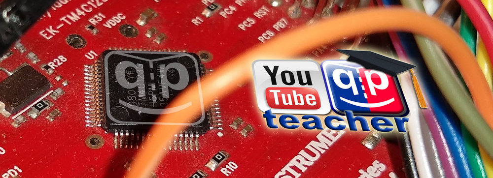
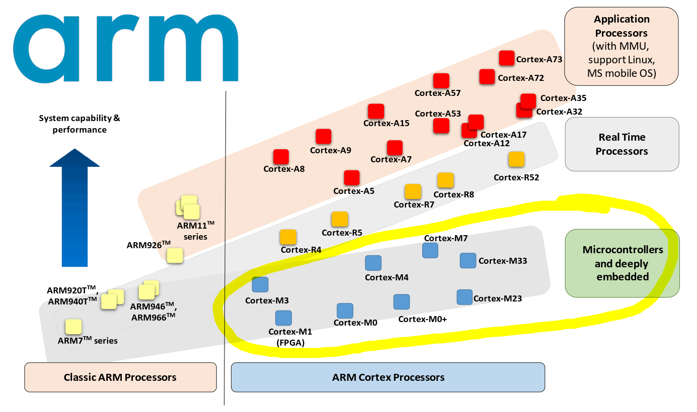
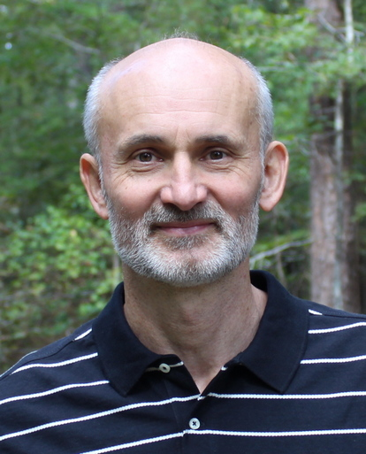
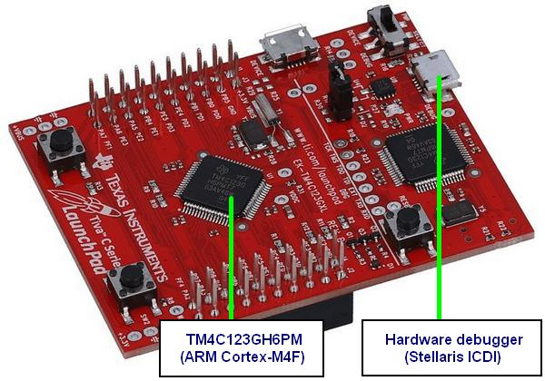
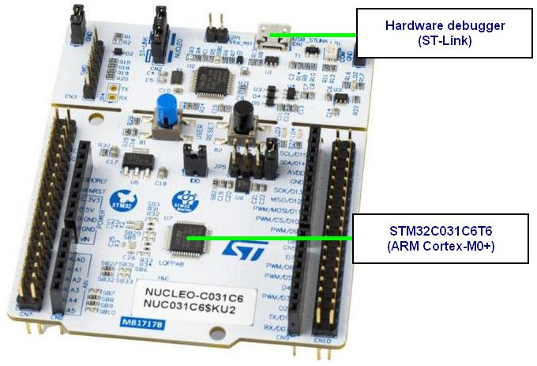
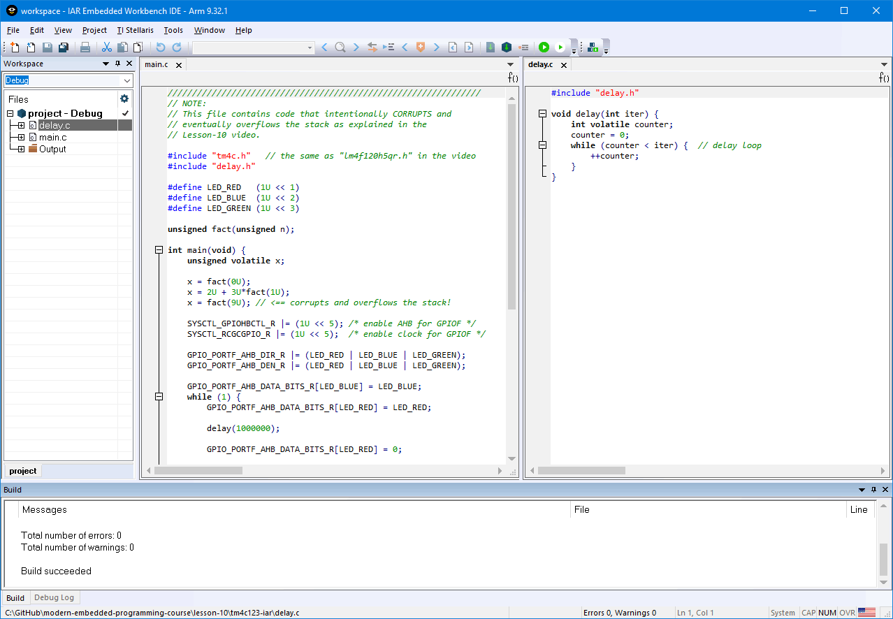
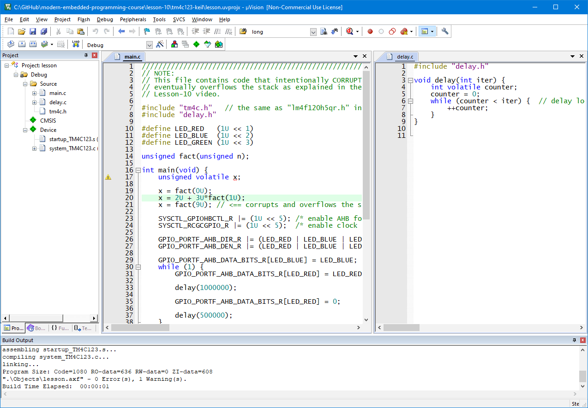
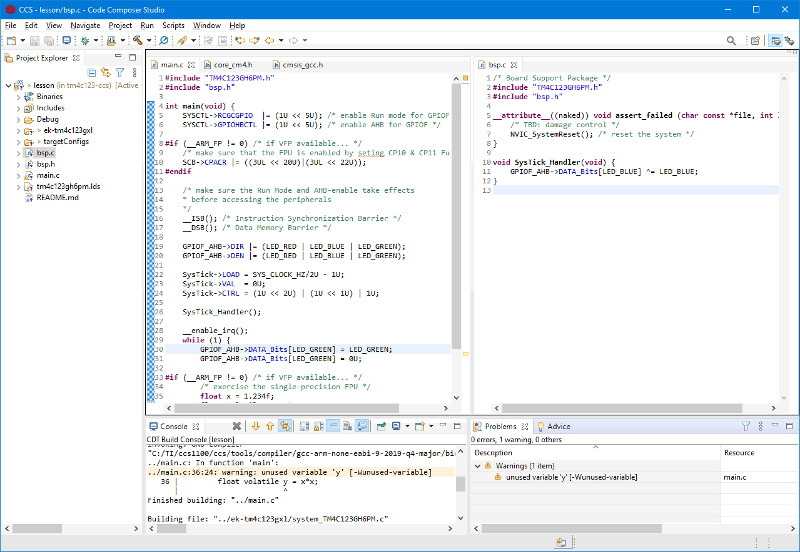

## Brought to you by:
[](https://www.state-machine.com)

---------------------------------------------------------------------
<p align="center">
<a href="https://www.youtube.com/@StateMachineCOM" target="_blank" title="QuantumLeaps on YouTube">

</a>
</p>

# Modern Embedded Systems Programming Course
Welcome to the ["Modern Embedded Systems Programming" video course](https://www.youtube.com/playlist?list=PLPW8O6W-1chwyTzI3BHwBLbGQoPFxPAPM).

In this course, you'll learn how to program embedded microcontrollers the modern way, from the basics all the way to the contemporary modern embedded programming practice.

The unique approach of this course is to step down to the machine level frequently and show you exactly what happens inside your embedded microcontroller. This deeper understanding will allow you to apply the concepts more efficiently and with greater confidence.

If you are looking for a practical, hands-on, well-structured, and in-depth course explaining the **essential concepts in embedded programming**, this *free* course is right for you.


# Relevance
The course started already in 2013, so a legitimate quesion is: "Is it still relevant?" The answer is YES, perhaps even more so than in 2013, for two main reasons:

### Fundamental Concepts
This course focuses on the **essential and fundamental concepts** in embedded programming, which never go out of style. All presetned concepts are covered in-depth, and include:
- Binary representations (two's complement), hexadecimal notation
- Flow of control, status register, branch instructions
- Variables, arrays, and pointers
- Interfacing with the outside world (GPIO)
- Bitwise operations in C
- Functions, call stack, recursion, ARM Procedure Call Standard
- Standard integers (stdint.h) and mixing integer types
- Structures in C and CMSIS
- Startup code, vector table
- Embedded software build process (linking process)
- Interrupts and race conditions
- "superloop" architecture
- RTOS (Real-Time Operating Systems)
- Object-oriented programming (including OOP in C)
- Event-driven programming
- Active objects
- State machines, including modern hierarchical state machines
- Automatic code generation
- Software tracing
- Assertions and Design by Contract

### ARM Cortex-M Architecture
This course focuses on the prevalent [<b>ARM Cortex-M</b>](https://www.state-machine.com/course/ARM-Cortex-M_for_beginners.pdf) architecture, which over the past decade became unquesionably dominat in the embedded MCU market. Familiarity with ARM Cortex-M is the most sought after skill that employers are looking for.

<p align="center">
<a href="https://www.state-machine.com/course/ARM-Cortex-M_for_beginners.pdf" target="_blank" title="Read: ARM Cortex-M for Beginners">

</a><br>
<em>ARM processors, including the Cortex-M family</em>
</p>


# Instructor
The course is designed and taught by [<b>Miro Samek</b>](https://www.state-machine.com/interview-with-miro-samek) -- an embedded software expert with over 30 years of experience. Miro enjoys teaching, and [this video course]((https://www.youtube.com/playlist?list=PLPW8O6W-1chwyTzI3BHwBLbGQoPFxPAPM)), [his books](https://www.state-machine.com/category/books), [articles](https://www.state-machine.com/an#Articles), and [conference talks](https://embeddedonlineconference.com/speaker/Miro_Samek) helped many developers improve their skills, pass tough job interviews, and get hired for embedded programming positions.

<p align="center">
<a href="https://www.state-machine.com/interview-with-miro-samek" target="_blank" title="Read interview with Miro Samek">

</a><br>
<em>Miro Samek</em>
</p>

# Prerequisites
The course starts with the basics, but this part is short and focused on the embedded aspects of programming in C. Therefore, you might need to supplement this course with a general study of the **C programming language**. You might also want to learn a bit about how a CPU works.

Also, this course is hands-on, meaning that to get the most out of this course you can and should follow along and run the discussed projects on your PC. To do this, you will need some [hardware](#hardware) (an embedded board) and [software](#software) (an embedded development toolset).

> **NOTE**<br>
Several early lessons use a **simulator** and therefore you don't need the embedded board right away. More advanced lessons, where you interact with the MCU peripherals (such as GPIO, etc.) require an embedded board.


## Hardware
The main embedded board used throughout the course is the [TivaC LaunchPad](https://www.ti.com/tool/EK-TM4C123GXL) board (a.k.a., EK-TM4C123GXL) based on the **ARM Cortex-M4F** microcontroller from Texas Instruments. The board is inexpensive and is still available for purchase from multiple electronic distributors. It is self-contained and provides a built-in hardware debugger/programmer (Stellaris ICDI) that enables single-step debugging and inspecting the internal state.

<p align="center">
<a href="https://www.ti.com/tool/EK-TM4C123GXL" target="_blank" title="TivaC LaunchPad (EK-TM4C123GXL)">

</a><br>
<em>TivaC LaunchPad (EK-TM4C123GXL)</em>
</p>

The [course downloads](#projects-for-the-course) now also contain project versions for the STM32 NUCLEO-C031C6, based on the **ARM Cortex-M0+** MCU. The board is also inexpensive, self-contained, and includes an even more versatile built-in hardware debugger (ST-Link) that enables single-step debugging and inspecting the internal state.

<p align="center">
<a href="https://www.st.com/en/evaluation-tools/nucleo-c031c6.html" target="_blank" title="STM32 NUCLEO-C031C6">

</a><br>
<em>STM32 NUCLEO-C031C6</em>
</p>

> **NOTE**<br>
Course projects for other inexpensive embedded boards will be added in the future.


## Software
In order to build and run the code presented in this course you will need one of the following embedded toolsets:

### IAR EWARM
The course started with the [IAR Embedded Workbench for ARM (EWARM)](https://www.iar.com), which is used in **lessons 1-19**. IAR EWARM is a professional toolset with a good compiler and stable debugger.

<p align="center">
<a href="https://www.iar.com" target="_blank" title="IAR Systems">

</a><br>
<em>IAR EWARM with one of the projecs</em>
</p>

> **NOTE**<br>
IAR EWARM used to be available under a free, size-limited KickStart licensing, but recently, IAR Systems stopped offering free licenses. The only free option left is a 2-week evaluation license. Projects for IAR EWARM have been updated to the newer versions of the toolset and are provided for lessons 1-19.


### KEIL MDK
[KEIL MDK](https://www.keil.com) (Microcontroller Development Kit) is another professional development toolset used in this video course. In contrast to IAR EWAR, KEIL MDK is offered under increasingly permissive licensing, including free [Keil MDK v6 Community Edition](https://www.keil.arm.com).

<p align="center">
<a href="https://www.keil.com" target="_blank" title="ARM/KEIL">

</a><br>
<em>KEIL uVision IDE with one of the projecs</em>
</p>

> **NOTE**<br>
KEIL MDK projects are now available for all lessons of this course. This includes lessons 1-21, which originally were presented for IAR EWARM or TI CCS.

### TI CCS
Due to popular demand, two lessons of the course (19 and 20) demonstrate the [Code Composer Studio (CCS)](https://www.ti.com/tool/CCSTUDIO) IDE from Texas Instruments. The only valuable aspect here is the use of the open source **GNU-ARM** compiler and linker.

> **NOTE**<br>
Code Composer Studio (CCS) 11 uses the TI compiler by default and no longer comes with the GNU-ARM compiler installed. But the GNU-ARM toolchain can be installed via the menu: "Help | Install GCC ARM Compiler Tools..."


<p align="center">
<a href="https://www.ti.com/tool/CCSTUDIO" target="_blank" title="Code Composer Studio">

</a><br>
<em>Eclipse-Based Code Composer Studio IDE with one of the projecs</em>
</p>

The CCS IDE is based on Eclipse and for that reason it is painfully slow to launch and use. The Eclipse projects are threrefore difficult to share because they consist of multiple files and directories. Also, projects cannot be simply opened in the IDE but instead need to be "imported". The generated error messages are often confusing. Finally, debugging is slow and unstable.


# Projects for the Course
This repository provides the project downloads that you can open in a specific embedded toolset and run on your PC at home. The projects are organized as illustrated in the following annotated directory tree:

```
modern-embedded-programming-course/
+---lesson-01/               // lesson number
|   +---simulator-iar/       // simulator with IAR EWARM
|   |        workspace.eww   // IAR workspace
|   |
|   \---simulator-keil/      // simulator with KEIL MDK
|        \---RTE/            // Run Time Environment for KEIL MDK
|            lesson.uvprojx  // uVision project
|
+---lesson-.../
|
+---lesson-04/
|   +---stm32c031-keil/      // STM32C031 board with KEIL-MDK
|   |   \---RTE/             // Run Time Environment for KEIL MDK
|   +---tm4c123-iar/         // TM4C123 board with IAR EWARM
|   |        workspace.eww   // IAR workspace
|   |
|   \---tm4c123-keil/        // TM4C123 board with KEIL MDK
|        \---RTE/            // Run Time Environment for KEIL MDK
|            lesson.uvprojx  // uVision project
|
+---lesson-...
|
+---lesson-19
|   \---tm4c123-ccs          // TM4C123 board with CCS
|        +---ek-tm4c123gxl/  // board-specific code
|        \---targetConfigs/  // CCS project directory
|            .ccsproject     // CCS project file
|            .csproject      // Eclispe project file
|            .project        // Eclipse project file

```


# Updates
All projects for ARM/KEIL uVision have been updated from the obsolete Compiler-5 to the newer Compiler-6.


# Comments/Discussion
If you would like to discuss this course or related subjects, please post your questions or comments on YouTube, in the commend section under each pertaining video lesson.


# Other Course Resources
Numerous resources for the video course are available through the companion webpage at:

[www.state-machine.com/video-course](https://www.state-machine.com/video-course)

Among others, you can find there:
- information about the hardware (board, logic analyzer, etc.)
- [Troubleshooting TivaC LaunchPad](https://www.state-machine.com/course/AN_Troubleshooting_TivaC.pdf)
- [Tiva TM4C123GH6PM Data Sheet](https://www.state-machine.com/course/TM4C123GH6PM_Datasheet.pdf)
- [USB Drivers for TivaC](https://www.state-machine.com/course/MDK_Stellaris_ICDI_AddOn.exe)
- [Flash Programmer for TivaC](https://www.ti.com/tool/LMFLASHPROGRAMMER)
- and more


# How to Help this Project?
If you like this project, please:

- [<b>subscribe to the Quantum Leaps YouTube channel</b>](https://www.youtube.com/channel/UCMGXFEew8I6gzjg3tWen4Gw?sub_confirmation=1)

<p align="center">
<a href="https://www.youtube.com/channel/UCMGXFEew8I6gzjg3tWen4Gw?sub_confirmation=1" target="_blank" title="QuantumLeaps on YouTube">
</p>
</a>
</p>

- spread the word about the videos you like (e.g., by posting on other websites frequented by embedded folks)

- give this GitHub repository a star (in the upper-right corner of your browser window):

<p align="center"></p>


