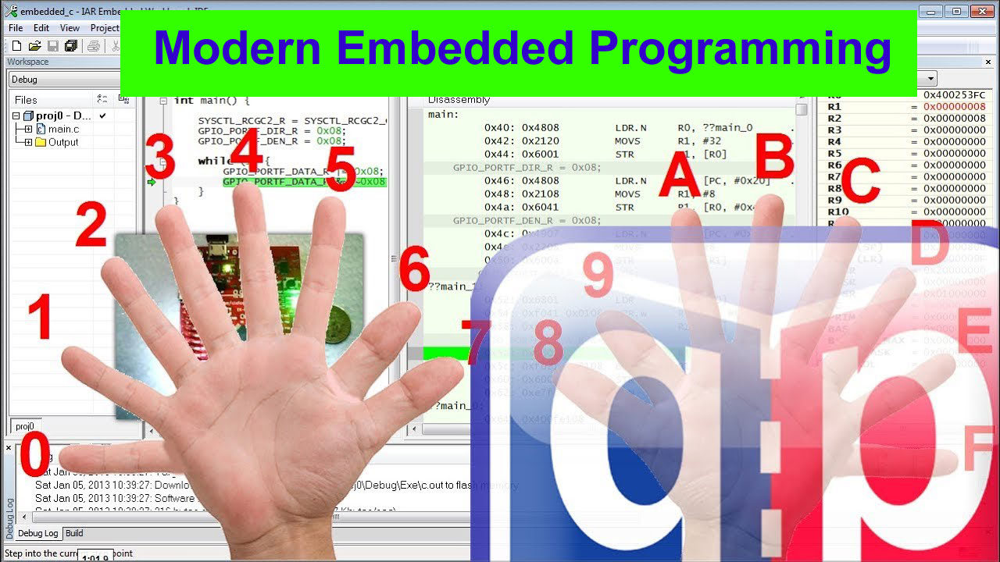

# What is it?
This repository is a companion to the ["Modern Embedded Systems Programming" video course](https://www.youtube.com/playlist?list=PLPW8O6W-1chwyTzI3BHwBLbGQoPFxPAPM),
which consists of focused, fast-paced, hands-on lessons that teach you how to program embedded microcontrollers in C. The course begins with the fundamentals, but gradually covers increasingly advanced concepts all the way to the contemporary modern embedded programming practice.

The course is specifically designed not just to be watched, but to be actively followed along on your own computer (Windows based PC) and a small, self-contained, very inexpensive evaluation board. This companion web-page provides the project downloads that you can open in a specific embedded toolchain and run on your PC at home.

The goal of the course is not just to teach C--other sources do it already quite well. But there are virtually no courses that would step down to the machine level and show you exactly what happens inside a microcontroller.

So, starting from Lesson 1 you will actually see how the ARM Cortex-M processor executes your code, how it manipulates registers, and how an embedded microcontroller can "do" things in the real world, such as turn on and off an LED.

This deeper understanding will allow you to use the C language more efficiently and with greater confidence. You will gain understanding not just what your program does, but also how the C statements translate to machine instructions and get a sense for how fast the processor can execute them. Also, you will get some familiarity with the ARM Cortex-M core, which will look really good on your resume.

The course has been going from January 2013, but it is never too late to join. Stay tuned...

---------------------------------------------------------------------
# Comments/Discussion
If you'd like to discuss this course or related subjects, plese use the ["Issues" tab](https://github.com/QuantumLeaps/modern-embedded-course/issues).

---------------------------------------------------------------------
# Contact Information

[www.state-machine.com/quickstart](https://www.state-machine.com/quickstart)

