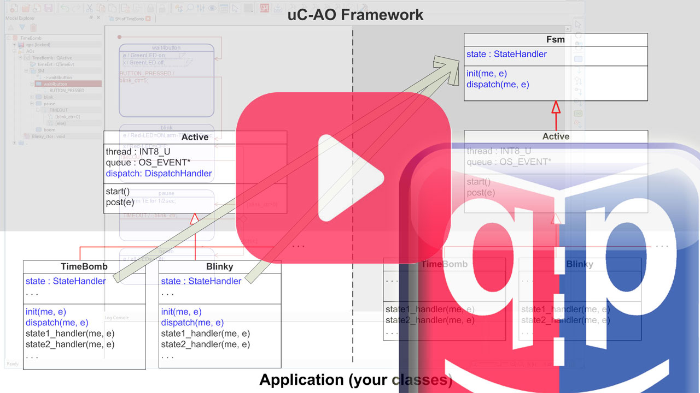
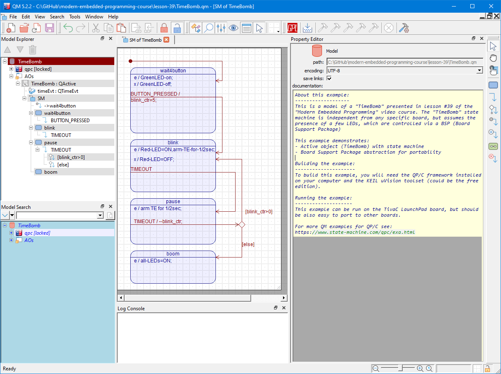

## Brought to you by:

---------------------------------------------------------------------

# About this example:
This is a model of a "TimeBomb" presented in
[lesson #39 "Optimal State Machine Implementation in C](https://youtu.be/FCymm6PBtOs)
of the ["Modern Embedded Programming" video course](https://www.youtube.com/playlist?list=PLPW8O6W-1chwyTzI3BHwBLbGQoPFxPAPM).

The "TimeBomb" state machine is independent from any specific board,
but assumes the presence of a few LEDs, which are controlled via a BSP
(Board Support Package)

This example demonstrates:
- Active object (TimeBomb) with state machine
- Board Support Package abstraction for portability

# TimbeBomb state machine
The TimeBomb state machine has been drawn in the freeware
[QM modeling tool](https://github.com/QuantumLeaps/qm):

# Building the example:
To build this example, you will need the QP/C framework installed on your computer and the KEIL uVision toolset (could be the free edition).

# Running the example:
This example can be run on the TivaC LaunchPad board, but should
be also easy to port to other boards.

For more QM examples for QP/C see:
https://www.state-machine.com/qpc/exa.html

# How to Help this Project?
If you like this project, please give it a star (in the upper-right corner of your browser window):

