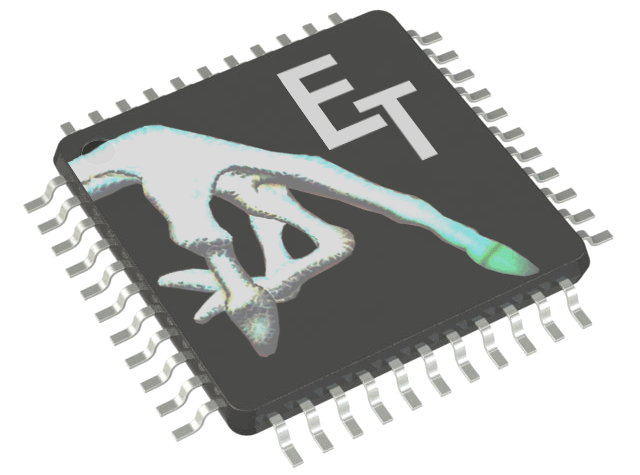
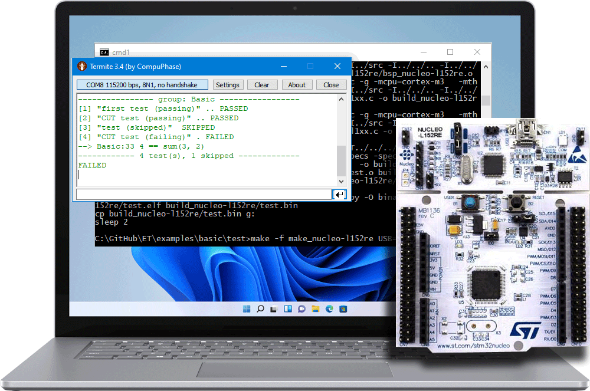
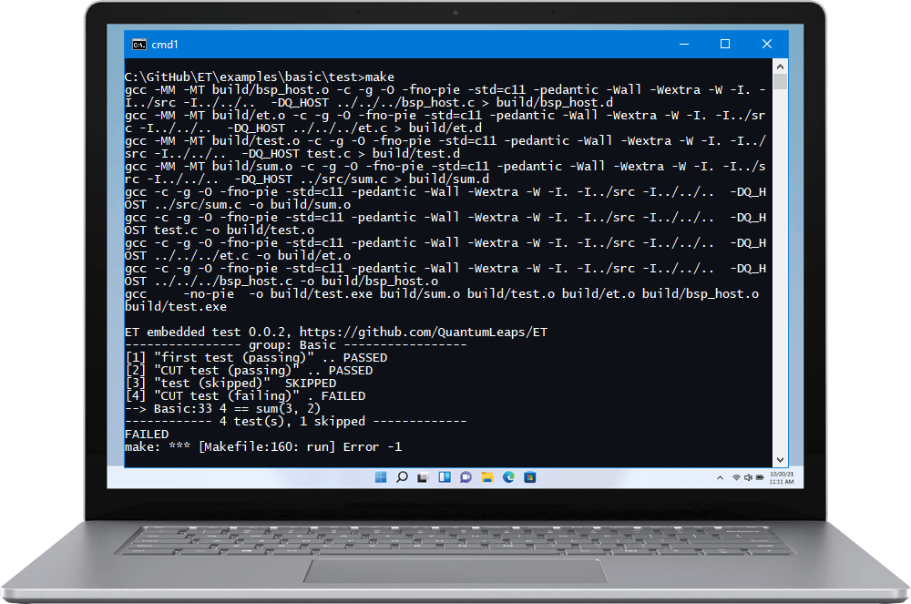
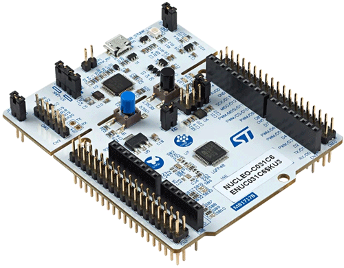
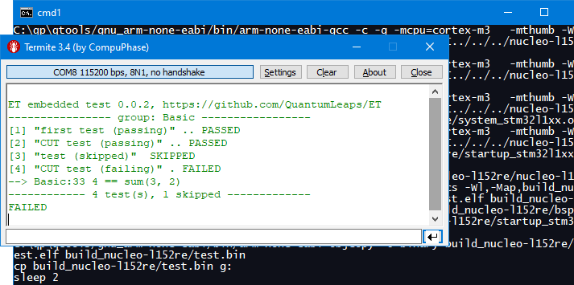

## Brought to you by:
[](https://www.state-machine.com)
<hr>

[](https://github.com/QuantumLeaps/Embedded-Test/releases/latest)
[](https://github.com/QuantumLeaps/Embedded-Test/blob/master/LICENSE)


# ET - The Super-Simple Embedded Test
Embedded Test (ET) is a super-simple, no-nonsense unit test framework in C for **bare metal** embedded systems without any dependencies on standard libraries or header files. ET is as simple as possible, but not simpler.

<p align="center"></p>

- no `printf()/sprintf()`, `malloc()`, `longjmp()`
- no `<stdio.h>` or any other standard header files
- no "test runners" or code-generating scripts to run in order to test code
- no myriads of various "test assertions" (just common `VERIFY()`)

> **NOTE**<br>
In spite of the completely bare-metal design, ET can execute most tests (those without "mocking") from the [Unity framework](https://github.com/ThrowTheSwitch/Unity) as well as from the book ["Test-Driven Development for Embedded C" by James W. Grenning](https://wingman-sw.com/test-driven-development-for-embedded-c-book). For instance, the [LedDriver example](examples/leddriver) demonstrates some tests from the Embedded-TDD book.


# Licensing
ET code and examples are released under the terms of the permissive
[MIT open source license](LICENSE). Please note that the attribution clause
in the MIT license requires you to preserve the original copyright notice
in all changes and derivate works.


# ET on Embedded Targets
On *embedded targets*, ET requires a serial port to output test results to the host. (The host computer must be running a serial utility to visualize the output from the embedded target.) ET provides a simple adaptation layer for any UART/USART in polling mode without interrupts. Please also see [Running on Embedded Board](#running-on-embedded-board).

<p align="center"></p>

# ET on Host Computers
ET can also run on *host computers* (Windws, Lunux, macOS) in console mode (in that case, ET takes advantage of `<stdio.h>`).

<p align="center"></p>

# ET Code Organization
ET consists of one small header file ([<b>et.h</b>](et.h)) and one small source file ([<b>et.c</b>](et.c)), which are both located in the root directory of the ET distribution. Additionally, the ET ditro contains [examples](examples) and embedded code for the [STM32 NUCLEO-C031C6 board](#running-on-embedded-board) (other boards can be added following that simple example).

```
Embedded-Test/     - root of the Embedded Test distribution
|
+---et/            - ET code (the only part of ET needed for external projects)
|   et.h           - ET header file
|   et.c           - ET source file
|   et_host.c      - ET implementation for host computers
|
+---examples/      - ET examples
|   +---basic/     - basic example in C
|   |   +---src/   - CUT (Code Under Test) sources
|   |   |      sum.h
|   |   |      sum.c
|   |   \---test/  - test code
|   |          test.c    - text fixture (see below)
|   |          Makefile  - makefile for testing on the host
|   |          ek-tm4c123gxl.mak  - makefile for EK-TM4C123GXL board (GNU-ARM)
|   |          nucleo-c031c6.mak  - makefile for NUCLEO-C031C6 board (GNU-ARM)
|   |          ek-tm4c123gxl.uvprojx - Keil-MDK project for EK-TM4C123GXL board
|   |          bsp_nucleo-c031c6.c - BSP for NUCLEO-C031C6
|   |
|   +---basic_cpp/ - basic example of testing C++ CUT
|   |          ...
|   |
|   \---leddriver/ - the LedDriver example from the "TDD in C" book
|   |          ...
|
+---3rd_party/     - 3rd-party code needed for embedded examples
|   +---ek-tm4c123gxl/ - code for the EK-TM4C123GXL (TivaC LaunchPad) board
|   +---nucleo-c031c6  - code for the STM32 NUCLEO-C031C6 board

```
> **NOTE**<br>
The example code is organized in the standard way for unit testing, into the `src` directory with the CUT and `test` directory with test-fixture and makefiles to build and run the tests.


# Basic ET Example in C
Here is the basic test fixture (see [examples/basic/test/test.c](examples/basic/test/test.c)), which tests a simple `sum(x,y)` function that returns `x+y`. The explanation section following the listing highlights the main points:

```c
 [1] #include "sum.h" /* Code Under Test (CUT) */
 [2] #include "et.h"  /* ET: Embedded Test */

 [3] void setup(void) { ... }
 [4] void teardown(void) { ... }

     /* test group -------------------------------------------------*/
 [5] TEST_GROUP("Basic") {

 [6] TEST("CUT test (passing)") {
 [7]    VERIFY(5 == sum(2, 3));
 [8]    VERIFY(5 == sum(3, 2));
     }

 [9] SKIP_TEST("test (skipped)") {
[10]    VERIFY(3 == 2*2); /* this would fail, but it's not checked */
     }

[11] TEST("CUT test (failing)") {
         VERIFY(5 == sum(2, 3));
[12]     VERIFY(4 == sum(3, 2)); /* <--- fails */
     }

[13] TEST("simple test (passing)") {
         VERIFY(4 == 2*2);
     }

[14] } /* TEST_GROUP() */

     /* dependencies for the CUT -----------------------------------*/
[15] . . .
```

`[1]` Test fixture must include the CUT (`sum.h` in this case)

`[2]` Test fixture must include the ET header file ([<b>et.h</b>](et.h))

`[3]` ET supports the `setup()` function, which is invoked *before* every non-skipped test. If a test group does not need to setup tests, an empty `setup()` function needs to be provided.

`[4]` ET supports the `teardown()` function, which is invoked *after* every non-skipped and non-failing test. If a test group does not need to tear down after tests, an empty `teardown()` function needs to be provided.

`[5]` The ET macro `TEST_GROUP()` defines a single "test group" to enclose all tests. The macro takes the name of the group, which is an arbitrary string. You can define it also as `__FILE__`.

> **NOTE**<br>
The "test group" in ET is the "test runner" function (`ET_run()`), which executes tests specified as the body of this function.


`[6]` The ET macro `TEST()` defines a single test. The macro takes the test name, which is arbitary string to be output to identify the test.

`[7]` The ET macro `VERIFY()` verifies the "test assertion". The macro takes a Boolean expression, which must evaluate to 'true'. If the expression evaluates to 'false' the test fails and ET will print the group-name and line number of the failing `VERIFY()`.

`[8]` A test can use `VERIFY()` multiple times.

`[9]` The ET macro `SKIP_TEST()` is for tests that are still under development and should be skipped for now. The macro has exactly the same form as `TEST()` to enable easy conversion of "skipped tests" into regular ones.

`[10]` The body of a "skipped" test is not executed. Neither are the `setup()` and `teardown()` callbacks for that test. This means that the `VERIFY()` "test assertion" is not evaluated, so it does not matter whether it evaluates to 'true' or 'false'.

### Failing Test in ET

`[11]` This is an example of a *failing* "test.

`[12]` Typically a test fails because one of the `VERIFY()` macros evaluates to 'false', which causes the **whole test to fail**. (A test can be also forced to fail by calling the `FAIL()` macro, which provides opportunity to output a "note" as to why a test was forced to fail.)

> **NOTE**<br>
In ET, a failing test **stopps** the whole run and causes an "exit" from the test-fixture (please see [Running on Embedded Board](#running-on-embedded-board) for discussion of what "exit" means on embedded targets). The rationale is that a failing test means that the following code is not to be trusted, so continuaiton makes no sense. This aligns with the TDD workflow, which requires *fixing* any failing test before continuing with other tests.

`[13]` Any `TEST()` following a failing test is *not* executed.

`[14]` The test group (see [5]) needs to be closed by a closing-brace `}`.

`[15]` The test group can be foolowed by any additional code, typically implementing some dependencies of the CUT.

## Running ET on the Host
The ET [examples](examples/basic/test) provide a simple [Makefile]([examples](examples/basic/test/Makefile) to build the tests and run them on a host (Windows, Linux, or macOS). Here is an example of running the basic test on the host (Windows command prompt in this case.)

```
C:\GitHub\ET\examples\basic\test>make
gcc -MM -MT build/bsp_host.o -c -g -O -fno-pie -std=c11 -pedantic -Wall -Wextra -W -I. -I../src -I../../..  -DQ_HOST ../../../bsp_host.c > build/bsp_host.d
gcc -MM -MT build/et.o -c -g -O -fno-pie -std=c11 -pedantic -Wall -Wextra -W -I. -I../src -I../../..  -DQ_HOST ../../../et.c > build/et.d
gcc -MM -MT build/test.o -c -g -O -fno-pie -std=c11 -pedantic -Wall -Wextra -W -I. -I../src -I../../..  -DQ_HOST test.c > build/test.d
gcc -MM -MT build/sum.o -c -g -O -fno-pie -std=c11 -pedantic -Wall -Wextra -W -I. -I../src -I../../..  -DQ_HOST ../src/sum.c > build/sum.d
gcc -c -g -O -fno-pie -std=c11 -pedantic -Wall -Wextra -W -I. -I../src -I../../..  -DQ_HOST ../src/sum.c -o build/sum.o
gcc -c -g -O -fno-pie -std=c11 -pedantic -Wall -Wextra -W -I. -I../src -I../../..  -DQ_HOST test.c -o build/test.o
gcc -c -g -O -fno-pie -std=c11 -pedantic -Wall -Wextra -W -I. -I../src -I../../..  -DQ_HOST ../../../et.c -o build/et.o
gcc -c -g -O -fno-pie -std=c11 -pedantic -Wall -Wextra -W -I. -I../src -I../../..  -DQ_HOST ../../../bsp_host.c -o build/bsp_host.o
gcc     -no-pie  -o build/test.exe build/sum.o build/test.o build/et.o build/bsp_host.o
build/test.exe

ET embedded test 0.0.2, https://github.com/QuantumLeaps/ET
---------------- group: Basic -----------------
[1] "first test (passing)" .. PASSED
[2] "CUT test (passing)" .. PASSED
[3] "test (skipped)"  SKIPPED
[4] "CUT test (failing)" . FAILED
--> Basic:33 4 == sum(3, 2)
------------ 4 test(s), 1 skipped -------------
FAILED
make: *** [Makefile:160: run] Error -1
```

> **NOTE**<br>
To run the tests on Windows you need the GCC C/C++ compiler accessible in your PATH as well as the `make` utility. Both are available in the [QTools collection](https://github.com/QuantumLeaps/qtools) for Windows.


### Host Adaptation Layer
The ET adaptation layer for running tests on the host is very simply implemented in the file [bsp_host.c](bsp_host.c):

```
#include "et.h" /* ET: embedded test */

#include <stdio.h>  /* for fputc() and stdout */
#include <stdlib.h> /* for exit() */

/*..........................................................................*/
void ET_onInit(int argc, char *argv[]) {
    (void)argc;
    (void)argv;
}
/*..........................................................................*/
void ET_onPrintChar(char const ch) {
    fputc(ch, stdout);
}
/*..........................................................................*/
void ET_onExit(int err) {
    exit(err);
}
```
This adaptation uses `<stdio.h>` for output to the console and `<stdlib.h>` for exiting after running the tests.


## Running ET on Embedded Board
The ET [examples](examples/basic/test) provide a simple makefile (see [nucleo-c031c6.mak](examples/basic/test/nucleo-c031c6.mak)) to build the tests for the STM32 NUCLEO-C031C6 shown below.

<p align="center"></p>

> **REMARK**<br>
The STM32 NUCLEO board has been selected because it can to be programmed by simply copying the binary image to the board enumerated as a USB drive.

The ET distribution contains all files requried to build the binary image for the NUCLEO-C031C6 board. However, you still need to provide the GCC-ARM compiler and the serial terminal utility to receive the output produced by the board. To run the test on the STM32 NUCLEO-C031C6, you open a terminal window and type:

> **NOTE**<br>
The GCC-ARM cross-compiler for Windows as well as the `make` utility are available in the [QTools collection](https://github.com/QuantumLeaps/qtools) for Windows.

```
cd ET\examples\basic\test

make -f make_nucleo-c031c6 USB=g:
```

The follwing screen shot shows the build process, programming the board (by copying the binary image) and the test output on the [Termite serial terminal](https://www.compuphase.com/software_termite.htm).

<p align="center"></p>

### Embedded Adaptation Layer
The ET adaptation layer for running tests on embedded targets implements exactly the same callback functions as the adaptation layer for the host, but is of course more complex because it uses the embedded UART. An example of adaptation layer is included in the file [examples/basic/test/bsp_nucleo-c031c6.c](examples/basic/test/bsp_nucleo-c031c6.c):

```
#include "et.h" /* ET: embedded test */

#include "stm32c0xx.h"  /* CMSIS-compliant header file for the MCU used */
/* add other drivers if necessary... */

. . .
/*..........................................................................*/
void ET_onInit(int argc, char *argv[]) {
    . . .
    /* enable peripheral clock for USART2 */
    RCC->APBENR1  |= (1U << 17U); /* enable USART#2 clock */
    RCC->IOPENR   |= (1U << 0U);  /* enable GPIOA clock for UART pins */

    /* Configure PA3 to USART2_RX, PA2 to USART2_TX */
    GPIOA->AFR[0] &= ~((15U << 4U*USART2_RX_PIN) | (15U << 4U*USART2_TX_PIN));
    GPIOA->AFR[0] |=  (( 1U << 4U*USART2_RX_PIN) | ( 1U << 4U*USART2_TX_PIN));
    GPIOA->MODER  &= ~(( 3U << 2U*USART2_RX_PIN) | ( 3U << 2U*USART2_TX_PIN));
    GPIOA->MODER  |=  (( 2U << 2U*USART2_RX_PIN) | ( 2U << 2U*USART2_TX_PIN));
    GPIOA->OSPEEDR&= ~(( 3U << 2U*USART2_RX_PIN) | ( 3U << 2U*USART2_TX_PIN));
    GPIOA->OTYPER &= ~(( 1U <<    USART2_RX_PIN) | ( 1U <<    USART2_TX_PIN));
    GPIOA->PUPDR  &= ~(( 3U << 2U*USART2_RX_PIN) | ( 3U << 2U*USART2_TX_PIN));
    GPIOA->PUPDR  |=  (( 1U << 2U*USART2_RX_PIN) | ( 1U << 2U*USART2_TX_PIN));

    USART2->BRR  = UART_DIV_SAMPLING16(SystemCoreClock, 115200U, 0U);
    USART2->CR1  = USART_CR1_TE_Msk | USART_CR1_RE_Msk
                   | USART_CR1_RXNEIE_RXFNEIE_Msk
                   | USART_CR1_UE_Msk;
    USART2->CR2  = 0x00000000U;
    USART2->CR3  = 0x00000000U;
}
/*..........................................................................*/
void ET_onPrintChar(char const ch) {
    while ((USART2->ISR & (1U << 7U)) == 0U) { /* while TXE not empty */
    }
    USART2->TDR = ch; /* put ch into the DR register */
}
/*..........................................................................*/
void ET_onExit(int err) {
    (void)err;
    /* blink the on-board LED2... */
    for (;;) {
        unsigned volatile ctr;
        GPIOA->BSRR = (1U << LD4_PIN); /* LED2 on */
        for (ctr = 100000U; ctr != 0U; --ctr) {}
        GPIOA->BSRR = (1U << (LD4_PIN + 16U)); /* LED2 off */
        for (ctr = 200000U; ctr != 0U; --ctr) {}
    }
}
```

### Exit from ET on Embedded Targets
A test fixture running on bare-metal embedded target does not have anything to "exit" to, so for such targets the `ET_onExit()` callback is implemented as an infinite loop that ties the CPU. The loop might blink an LED to show some activity, but this is not strictly necessary.

# How to Help this Project?
Please feel free to clone, fork, and make pull requests to improve ET.
If you like this project, please give it a star (in the upper-right corner of your browser window):

<p align="center"></p>
