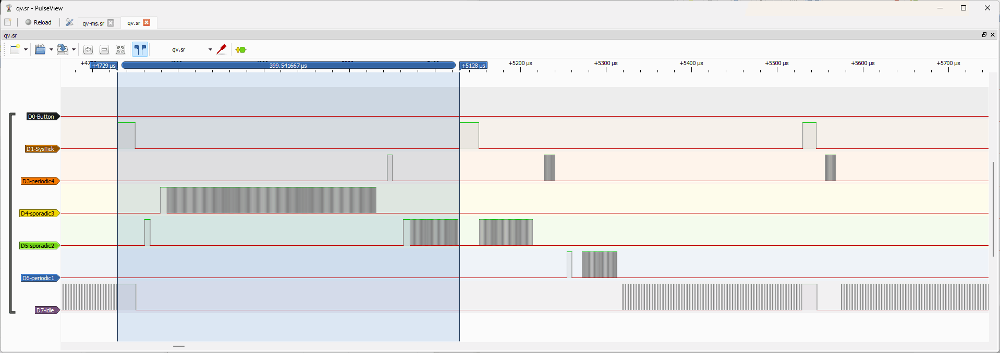
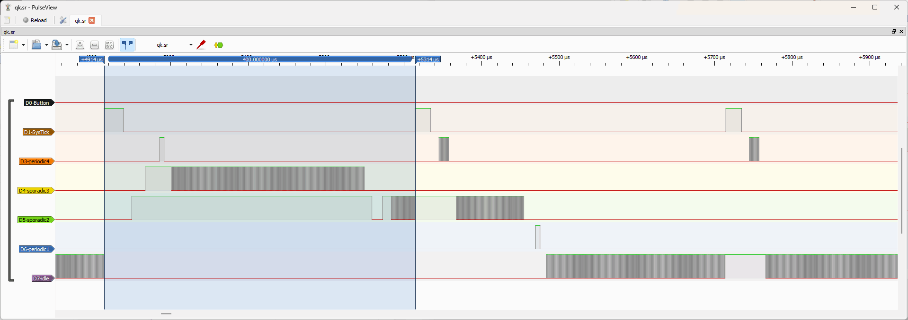
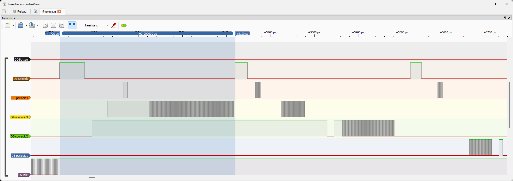

# Logic Analyzer Connection (CHx) to EK-TM4C123GXL board:

      J1     J3                                 J4     J2

    +3.3V    VBUS                        CH4 -- PF2    GND -- GND
      PB5    GND                         CH8 -- PF3    PB2
      PB0    PD0 -- CH5                         PB3    P30
      PB1    PD1 -- CH6                         PC4    PF0
      PE4    PD2 -- CH7                         PC5    RST
      PE5    PD3                                PC6    PB7
      PB4    PE1                                PC7    PB6
      PA5    PE2                                PD6    PA4
      PA6    PE3                                PD7    PA3
      PA7    PF1 -- CH2                  CH1 -- PF4    PA2

# Example Logic Analyzer Traces

 
<b>Logic analyzer trace after pressing the button (non-preemptive QV kernel)</b>

 
<b>Logic analyzer trace after pressing the button (preemptive QK kernel)</b>

 
<b>Logic analyzer trace after pressing the button (preemptive FreeRTOS kernel)</b>

