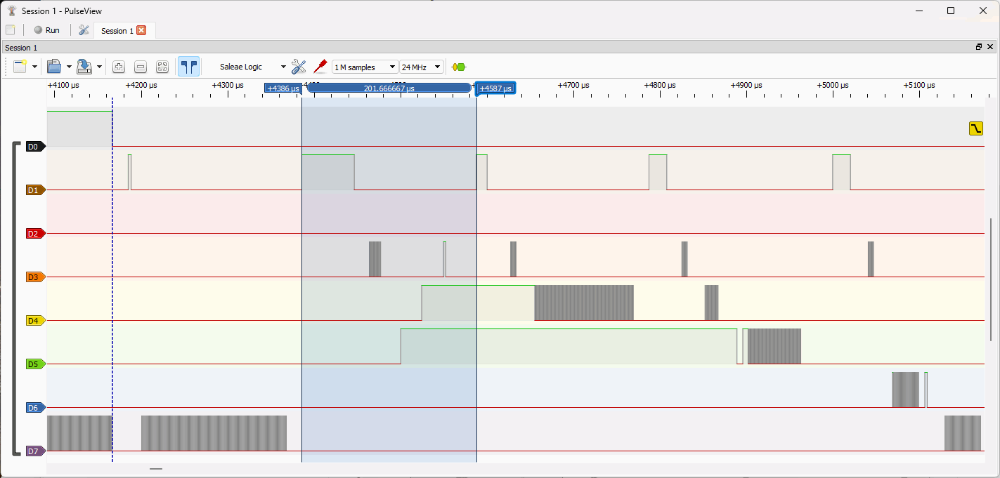

# Real-Time Example for Zephyr

<p align="center">

</p>

# Overview
The "real-time" example demonstrates the real-time performance and
various preemption scenarios among multiple Active Objects.

> NOTE: This example works **only** on the on the STM32 NUCLEO-C031C6
board (Cortex-M0+). Also, to examine the timing, you need a logic analyzer
(see [Functionality](#functionality))

<p align="center">
<br>
<b>STM32 NUCLEO-C031C6 board (ARM Cortex M0+ @48MHz)</b>
</p>

# Setting Up Zephyr Environment (Linux)
Open a terminal in the directory of this example
(`qpc/examples/zephry/real-time_nucleo-c031c6`).

Depending on your Zephyr installation, you might need to shell the scripts
to configure Zephyr environment:

```
source ~/zephyrproject/.venv/bin/activate
source ~/zephyrproject/zephyr/zephyr-env.sh
```

# Setting Up Zephyr Environment (Windows)
Open a command prompt in the directory of this example
(`qpc\examples\zephry\real-time_nucleo-c031c6`).

Depending on your Zephyr installation, you might need to execute the batch
scripts to configure Zephyr environment:

```
%HOMEPATH%\zephyrproject\.venv\Scripts\activate
%HOMEPATH%\zephyrproject\zephyr\zephyr-env.cmd
```

# Building
To build the example on any host OS, type:
```
west build -b nucleo_c031c6 -- -DQIDLE=ON
```
> NOTE: This example works **only** on the nucleo_c031c6 board

> NOTE: The `QIDLE=ON` option causes activation of the application-
level "idle thread", which toggles the D7 line (the User LED on the
NUCLEO-C031C6 board (LD4), see [Functionality](#functionality))

# Flashing the Board
To flash the board, type:
```
west flash
```

Alternatively, if the STM32CubeProgrammer is not installed,
you can simply *copy* the binary image to the NUCLEO board as
follows:
```
copy build\zephyr\zephyr.bin f:
```
Where `build\zephyr\zephyr.bin` is the binary produced by
the `west build` command, and `f:` is the USB drive corresponding
to the NUCLEO board. (NOTE: you need to adjust the drive name
to your system.)

# Functionality
The "real-time" runs four Active Objects that demonstrate various
preemption scenarios. The following logic analyzer trace shows the
behavior triggered by pressing the blue User Button on the board:

<p align="center">
<br>
<b>Logic analyzer trace triggered by the button-press</b>
</p>

Traces:
- D0 blue user button on the board (active low)
- D1 clock tick ISR (running at 5000Hz, i.e., every 200us)
- D2 not used
- D3 "periodic4" active object at priority 4 (highest)
- D4 "sporadic3" active object at priority 3
- D5 "sporadic2" active object at priority 2
- D6 "periodic1" active object at priority 1
- D7 "idle thread" at priority 0 (lowest)

And here is the diagram showing how the logic analyzer has
been connected to the NUCLEO board:

<p align="center">
<br>
<b>Connecting the logic analyzer to the NUCLEO-64 board</b>
</p>

